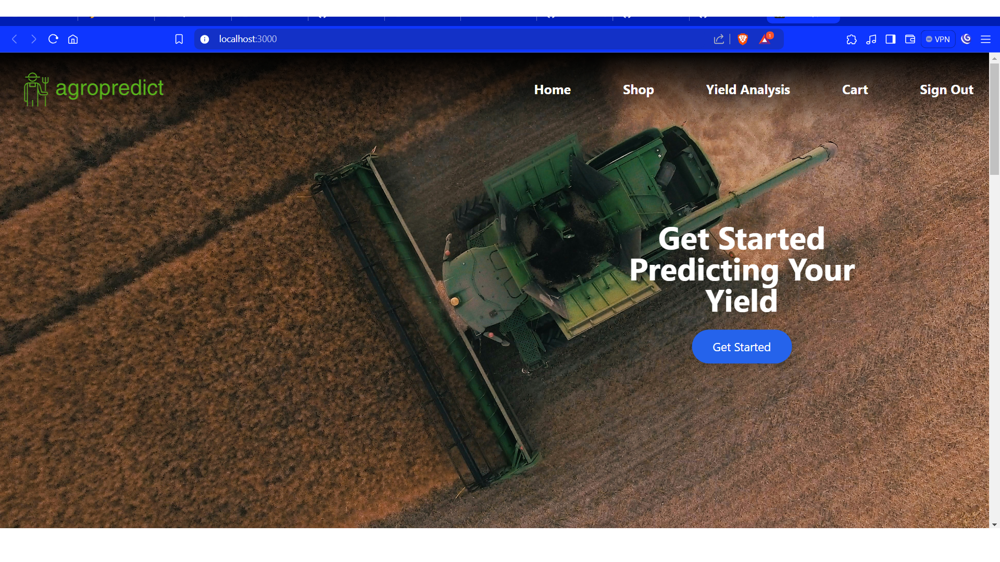
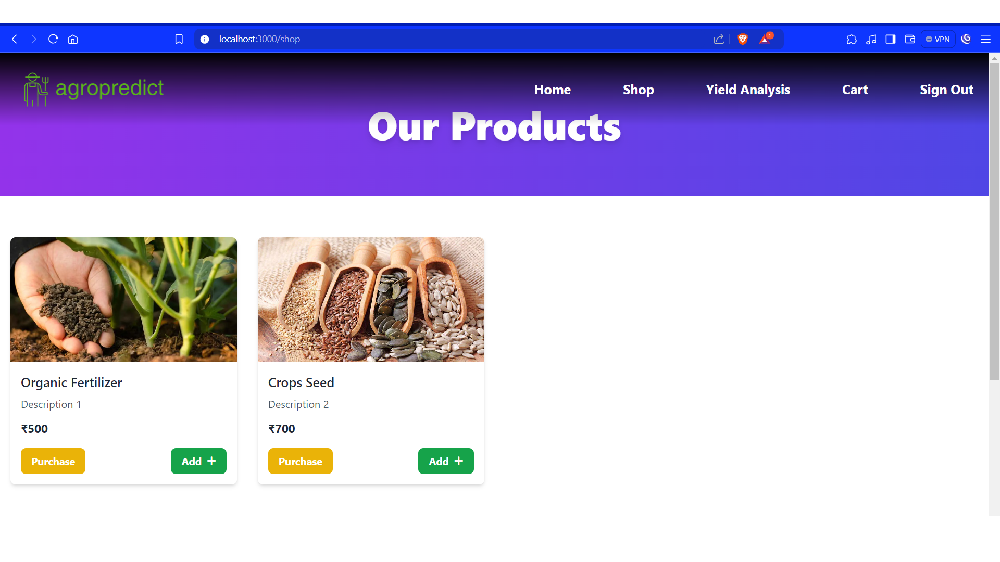
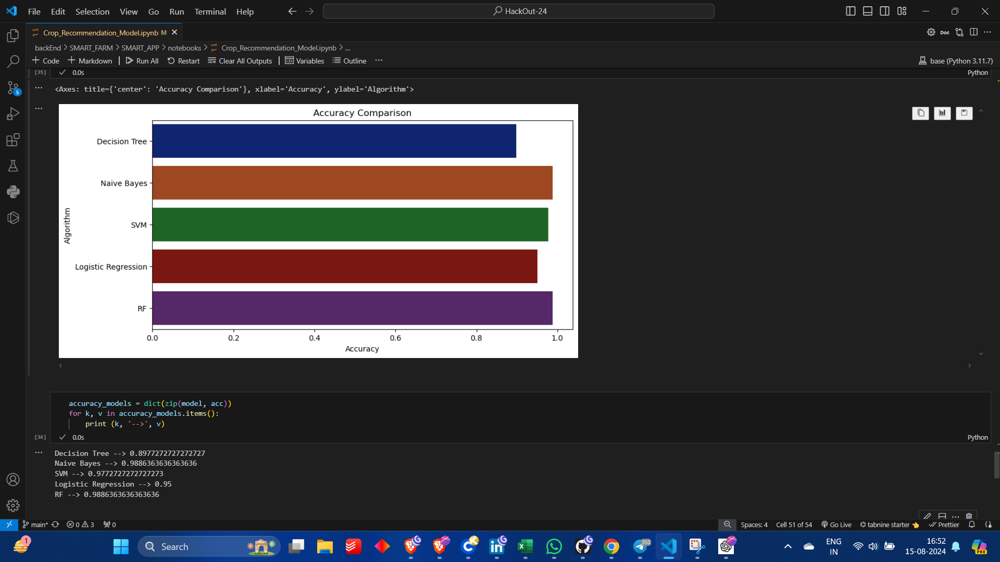
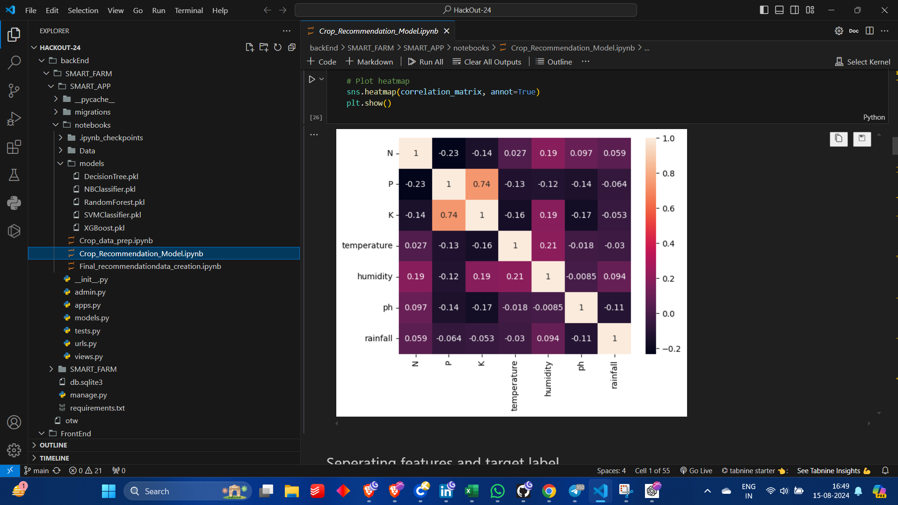

---

# AgroPredicts

**AgroPredicts** is a web-based application designed to assist farmers in maximizing their agricultural yield through machine learning predictions and a user-friendly marketplace. Built with React for the frontend and Django for the backend, this platform leverages REST APIs to provide a comprehensive suite of tools for modern farming.

## Features

- **Yield Analysis**: Analyze crop yields and predict which crops will perform best in upcoming seasons based on historical data and current conditions.
- **Fertilizer Recommendations**: Receive tailored suggestions for fertilizers to enhance crop growth and optimize yield.
- **Marketplace**: Buy and sell crops and seeds directly through the platform, facilitating transactions and increasing revenue opportunities for farmers.
- **Model Performance**: The system is powered by several machine learning models, tested and evaluated for accuracy:
  - **Decision Tree**: 0.898
  - **Naive Bayes**: 0.989
  - **Support Vector Machine (SVM)**: 0.977
  - **Logistic Regression**: 0.950
  - **Random Forest**: 0.989

## Technologies Used

- **Frontend**: React
- **Backend**: Django
- **Machine Learning**: Python, Scikit-Learn
- **APIs**: Django REST Framework

## UI

## Model Evaluation

The machine learning models used in AgroPredicts have been rigorously tested for accuracy:

- **Decision Tree**: 89.8%
- **Naive Bayes**: 98.9%
- **SVM**: 97.7%
- **Logistic Regression**: 95.0%
- **Random Forest**: 98.9%

## Future Scope

- **Enhanced Prediction Models**: Integrate more advanced models and techniques to improve prediction accuracy.
- **Additional Features**: Expand the platform with more features such as weather forecasts and pest detection.
- **Global Reach**: Adapt the system for use in different regions with varying agricultural conditions and requirements.

## Disadvantages

- **Data Quality**: The accuracy of predictions depends on the quality and quantity of the input data.
- **Model Complexity**: Some machine learning models may require significant computational resources for training and inference.
- **User Interface**: The current interface may need improvements based on user feedback to enhance usability.

---

